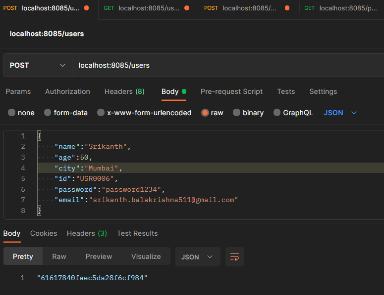
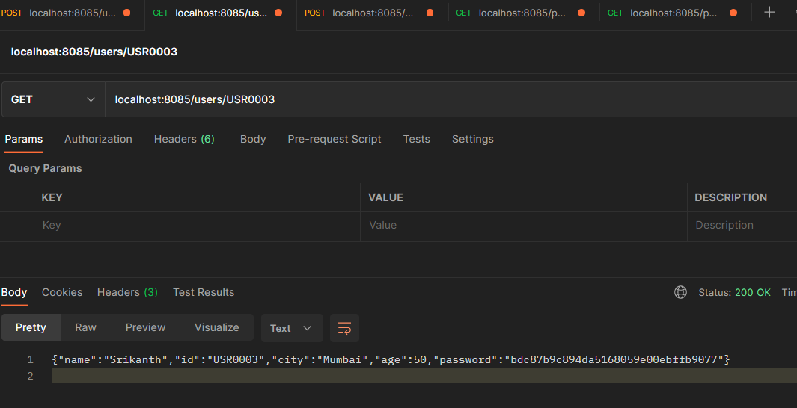
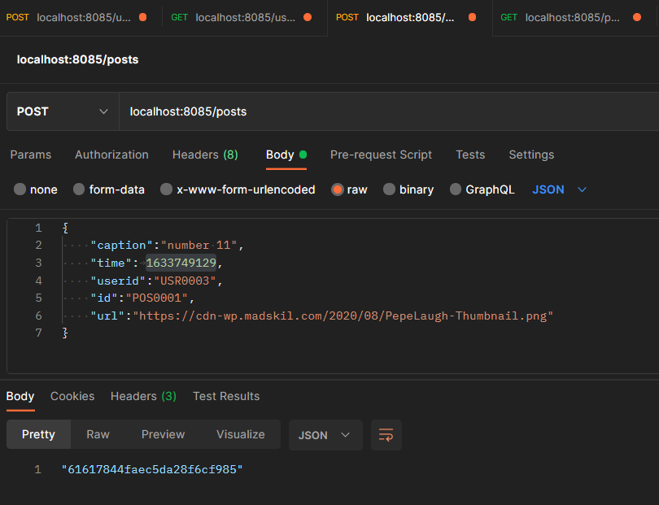
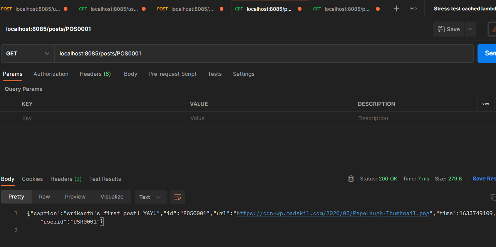

 
##### Srikanth Balakrishna - 19BCE0158

## Instagram Backend API
This repository was created to implement the backend technical task from Appointy:
https://docs.google.com/document/d/1sFhVumoczf_PmaL_R__Rm9AHqaHsUWgj1x9YcQP6Is4/preview?pru=AAABfIQlmXU*gS6dgizk7ILWVZoh4AxwqA#heading=h.2rc4dswyq09p
## Contents:
- [Introduction](#introduction)
- [Code OverView](#code-overview)
- [Code Walkthrough](#code-walkthrough)
- [Exploring Areas for improvement](#areas-for-improvement)

## Introduction
Hey there Reader! Welcome to my repo. Before we dive in further, I would like to mention that this was my first time using GO,   
and it was very much a great experience!   
I am quite liking the syntax and structure of GO and very much looking forward to writing more code with it!     

This project implements all the 5 HTTP-JSON endpoints as specified in the task
 - Create a User: `POST@("/users")`:
    Accepts a JSON payload for a user-entity/document that looks like the following:
    ```
    {
    "name":"Srikanth",
    "age":50,
    "city":"Mumbai",
    "id":"USR0006",
    "password":"password1234",
    "email":"srikanth.balakrishna511@gmail.com"
    }
    ```
    The request returns HTTP OK (200) status code and the MongoDB auto-generated key associated with this document
    ### example:    
    <br><br>
    

 - Get a user by id: `GET@("/users/{id}")`
   ### example:     
   <br><br>
 - Create a post: `POST@("/posts")`
 Accepts a JSON payload for a user-entity/document that looks like the following:
    ```
    {
    "caption":"My first post!! YAY",
    "time":	1633749129,
    "userid":"USR0003",
    "id":"POS0001",
    "url":"https://cdn-wp.madskil.com/2020/08/PepeLaugh-Thumbnail.png"
    }
    ```
    _Note: "time" attribute of the JSON represents the number of milliseconds that have passed since Unix Epoch_
    ### example:    
    <br><br>
 - Get a post by id: `GET@("/posts/{id}")`
    ### example:
    <br><br>  
    
The application also has the following features as enumerated by the task requirements:
 - Secure storage of password:  _Via AES encryption algorithm using a secret key_
 - Server Thread safety: By ensuring concurrency in all functions by making them synchronized using a Mutex
 - Pagination for get-all-posts-of-user API: It accepts a HTTP request parameter _page_ which is used for pagination
 - Unit tests for all the functions which were used for the core-logic
 
 
## Code Overview


## Code Walkthrough

## Areas for improvement
