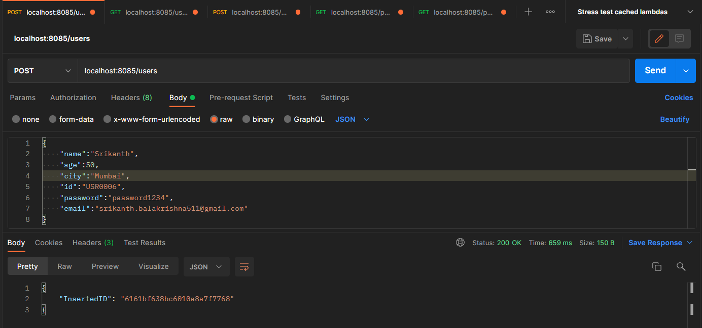
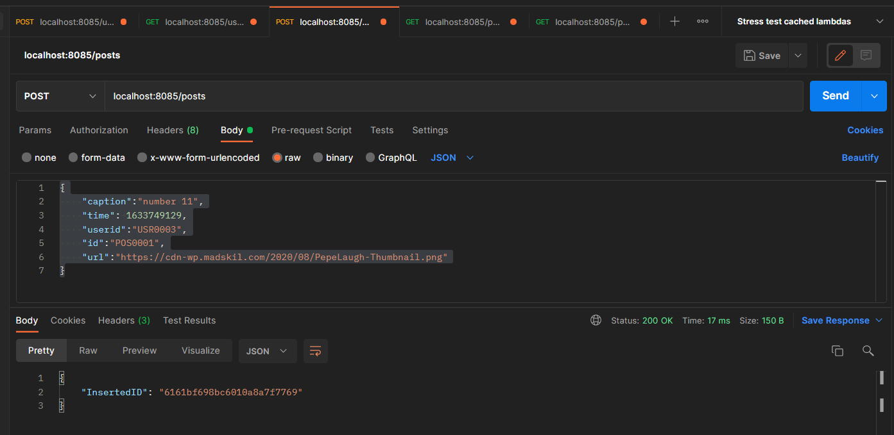
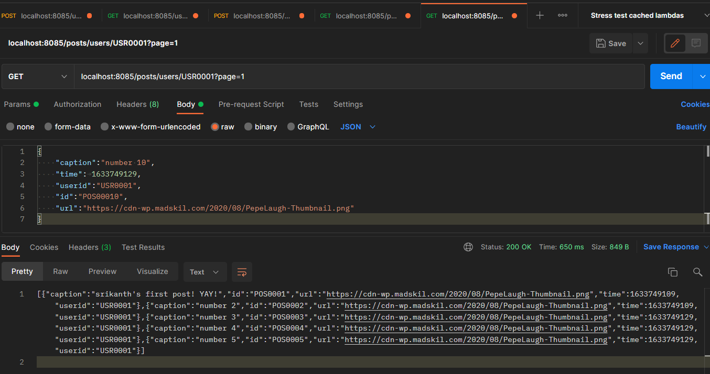

 
##### Srikanth Balakrishna - 19BCE0158

## Instagram Backend API
This repository was created to implement the backend technical task from Appointy:
https://docs.google.com/document/d/1sFhVumoczf_PmaL_R__Rm9AHqaHsUWgj1x9YcQP6Is4/preview?pru=AAABfIQlmXU*gS6dgizk7ILWVZoh4AxwqA#heading=h.2rc4dswyq09p
## Contents:
- [Introduction](#introduction)
- [Code Overview](#code-overview)
- [Exploring Areas for improvement](#exploring-areas-for-improvement)


# Introduction
Hey there Reader! Welcome to my repo. Before we dive in further, I would like to mention that this was my first time using GO,   
and it was very much a great experience!   
For the most part I simply read and followed along the instructions given for each package from docs: https://pkg.go.dev/std,
and for a few files i utilized code snippets that i found online and tailored to fit the application.
I am quite liking the syntax and structure of GO and very much looking forward to writing more code with it!     

This project implements all the 5 HTTP-JSON endpoints as specified in the task
 - Create a User: `POST@("/users")`:
    Accepts a JSON payload for a user-entity/document that looks like the following:
    ```
    {
    "name":"Srikanth",
    "age":50,
    "city":"Mumbai",
    "id":"USR0006",
    "password":"password1234",
    "email":"srikanth.balakrishna511@gmail.com"
    }
    ```
    The request returns HTTP OK (200) status code and the MongoDB auto-generated key associated with this document
    ### example:    
    <br><br>
    

 - Get a user by id: `GET@("/users/{id}")`
   ### example:     
   <br><br>
 - Create a post: `POST@("/posts")`
 Accepts a JSON payload for a user-entity/document that looks like the following:
    ```
    {
    "caption":"My first post!! YAY",
    "time":	1633749129,
    "userid":"USR0003",
    "id":"POS0001",
    "url":"https://cdn-wp.madskil.com/2020/08/PepeLaugh-Thumbnail.png"
    }
    ```
    _Note: "time" attribute of the JSON represents the number of milliseconds that have passed since Unix Epoch_      
    _Note:_ **The assumption was that "userid" would be the attribute that links the posts and the users.** and would the one used in the last API endpoint.    
    ### example:    
    <br><br>
 - Get a post by id: `GET@("/posts/{id}")`
    ### example:
    <br><br>  
 - List all posts of a user: `GET@("/posts/users/{userid}")`    
    ### example:
        
    Note: Employed pagination by accepting "page" request parameter. The number of results per page was limited based on `CountPerPage` in [/posts/postEntity.go](/posts/postEntity.go)     
    If page-parameter is not sent in the request then the app returns the first page by default,
    and page 0 is treated same as page 1
    
The application also has the following features as listed in the task document:
 - Secure storage of password:  _Via AES encryption algorithm using a secret key_
 - Server Thread safety: By ensuring concurrency in all functions by making them synchronized using a Mutex
 - Pagination for get-all-posts-of-user API: It accepts a HTTP request parameter _page_ which is used for pagination
 - Unit tests for all the functions which were used for the core-logic (with around 90% coverage)
 
 
# Code Overview
I have not followed any particular convention for the structure of the project files and folders.    
Let us have a brief overview on each of the files and folders so we know the flow of the application before diving into the code
 ### `main.go`
 In the root directory we have `main.go` which is the entry-point of the project, inside which:
 - The _main()_ defines all the 5 API endpoints using using http.HandleFunc(), It also starts the server at port 8085
 (Note: I followed the format similar to that from the docs: https://pkg.go.dev/net/http@go1.17.2 )
 ### `/dbservice/getDbClient.go`
 This file is where i relied most on code-snippets and examples from the docs and online.    
 Optimised connection using Once() concept where the connection is made only once and subsequent calls to the function from other functions & threads reuses the same connection.      
    
**Note: Implemented thread safety for each function below by giving it a mutex to use, to ensure that only one thread can use it at a time.**
 ### `/users`:
  - `createUser.go`: CreateUser(): accepts one user and inserts it into MongoDB
  - `getUser.go`: GetUser(): accepts a user-id (string) and returns one document that matches the _id_
  - `userEntity.go`: Defines struct User, and implements methods for it that perform the password encryption. createHash() converts our passphrase into a hash key and EncryptPassword() encrypts the user's password using AES encryption and the key.
  - `UserFunctions_test.go`: Basic Unit tests for all the utilities used
 ### `/posts`:
  - `createPost.go`: CreatePost(): accepts one post and inserts it into MongoDB
  - `getAllPostsByUserId.go`:     
         - GetAllPostsByUserId(): accepts user-id & page number and returns the corresponding documents page-wise      
         - paginate(): code-snippet that returns the desired slice of the []posts array      
  - `getPost.go`: GetPost(): accepts a post-id (string) and returns one document that matches the _id_
  - `postEntity.go`:  Defines struct Post and the page-capacity that is used for pagination
  - `PostFunctions_test.go`: Unit tests


# Exploring Areas for improvement
There are many portions of the application where i felt that i should have done a better job but could not, due to the time constraint as well as me simply being completely new to the GO syntax.   
  
1] **Password encryption**: I wanted to utilize _**salting**_ as well as hashing so that the passwords cannot be easily reverse engineered using brute force or rainbow table attacks    

2] **Pagination**: I found many references online to skip() and limit() only to realise that these functions were not available in the standard mongo-driver package.
So i resorted to simply fetching all the documents each time and manually returning the required segment.
Instead of fetching all documents and manually paginating results each time,We should query documents according to the page-number
i.e, skip((pageNumber-1)*CountPerPage) and limit(CounterPerPage)    
But even this approach can become slow as the number of documents increase.     
The best way would be have a sorting order(like sorting by ID) and then using a range and
selecting only those documents from mongoDB that correspond to the right index (index <---derived---- pageNumber)

3] **Primary keys and uniqueness of documents**: Given the state of the current code, i can create multiple objects with the same values because mongoDB auto-assigns primary-keys. We need to eliminate this redundancy by making "id" the unique identifier (quick-fix could be that we could use the autogenerated _id as the unique identifier)

4] **Approach for thread safety**: I was very new to GO and wasn't able to explore the "sync" package in depth, so I utilised the simplest approach i could think of after a couple of Google Searches: synchronising/locking each function with a mutex.    
"_With the Mutex approach, the queue exists implicitly at Lock() and is unbounded. However, they can be a backlog in case of long execution times, then bursts of executions following. This can cause performance issues when there are a large number of requests._" -Stackoverflow.  
I am very much interested to see what is the right and more efficient way of concurrency control

5] **Testing**: Rather than actually connecting to mongoDB, it would be better to mock the mongoDB response(i.e, employ mocking!)

